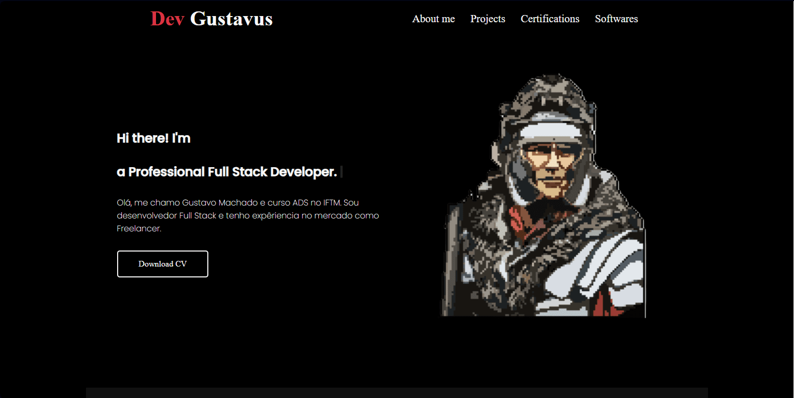

<h1 align="center">Portfolio</h1>

## 📲 View the project here
<a href="https://devgustavus.github.io/portofolio/">https://devgustavus.github.io/portofolio/</a>

## 📖 About the project
This project stands out for its unique purpose: to professionally introduce myself to the world. Nevertheless, I employed various techniques to make the site aesthetically pleasing and dynamic, ensuring a good user experience. In my first portfolio, I refrained from using any frameworks, opting instead for "pure" languages and tools. I constructed each element of the site through manual effort, enhancing my understanding of its functionality.

### Social media:

[](https://www.linkedin.com/in/gustavo-machado-pontes-161616286/)
[](https://profile.indeed.com/welcome)
[](https://www.instagram.com/devgustavus/)



## 🦾 Technologies used
<div style="display: flex;">
  


</div>

## 🤔 What i learned
- I was able to enhance the UX/UI to professionally introduce myself to the world.
- I learned how to create "accordion lists."
- I learned to build an image slider using an API.
- I improved my skills with grid structures.

## 👽 How to clone this project

````bash
    # Select where you want to clone
    $ cd ~/Documents
````

````bash
    # Clone the project
    $ git clone https://github.com/DevGustavus/form_login_cadastro.git
````

````bash
    # Check if cloning worked fine
    $ cd ~/Documents/form_login_cadastro
    $ ls
````
